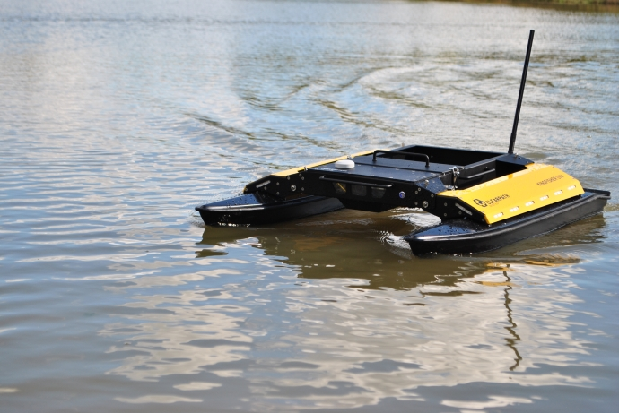

Kingfisher USV Tutorials
=========================    

    

Kingfisher Unmanned Surface Vessel (USV) is an agile, battery operated boat designed for research and rapid prototyping. Fully equipped with a sensor station, an onboard Atom PC for running hardware drivers and intelligence, electric thrusters, GPS, wifi radio, and semi-planing hulls, Kingfisher serves as a marine research platform as well as a remote survey system for bathymetric and hyrometric data collection. This USV includes advanced payload capabilities, easy stow and portability, and can be easily customized to meet research requirements.

Kingfisher USV is ready for teleoperation out-of-the-box with integrated GPS, IMU, compass, and ROS drivers.

For more information or to receive a quote, please `visit us online <http://clearpathrobotics.com/kingfisher>`_.

.. toctree::
    :titlesonly:
    :hidden:
    :caption: Getting Started

    Overview <self>
    WorkingWithKingFisher.rst
    Teleoperation.rst 
    CompassCalibration.rst
    SupportingPackages.rst
    Instruments.rst

